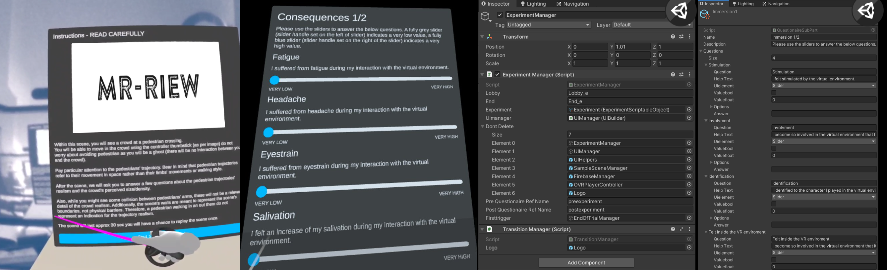

# MR-RIEW

## An MR Toolkit for Designing Remote Immersive Experiment Workflows

  

We present MR-RIEW, a toolkit for virtual and augmented reality that provides researchers with a dynamic way to design an immersive experiment workflow including instructions, environments, sessions, trials and questionnaires. It is implemented in Unity via scriptable objects, allowing simple customisation. The graphic elements, the scenes and the questionnaires can be selected and associated without code. MR-RIEW can save locally into the headset and remotely the questionnaire's answers. MR-RIEW is connected to Google Firebase service for the remote solution requiring a minimal configuration.

Unity 2021.2.2.7f1, current platforms supported: Oculus Quest, Oculus Quest 2

Documentation: [Here](https://github.com/CrowdVRLab/MR-RIEW/blob/main/HowToUse.md).

Tutorial's Youtube Playlist: [Here](https://www.youtube.com/playlist?list=PLCsH8hycEVh8p6k0wocmQen9OFggqp5CM).

## Authors

Riccardo Bovo, Daniele Giunchi, Anthony Steed, Thomas Heines

Imperial College

University College London

##Passthrough

For enabling Oculus Passthrough (that allow MR) do the following:

- Use a template scene of MR-RIEW (templates can be VR or MR)

- Open Build Settings and switch to Android platform

- Open Project Settings and switch "Color Space" to Linear

- Change "Script Backend" to IL2CPP and enable "ARM64" Target Architectures only

- Open Project Settings > Install XR Plugin Management and click "Install XR Plugin Management", enable "Oculus" plugin

- Import Oculus Integration 35.0 (click "Yes" "Restart" "Upgrade" if Unity asks it)

- Open the "AugumentedObjects" scene in Assets/Oculus/SampleFramework/Usage/Passthrough/Scenes

- IMPORTANT: Select OVRManager and enable "Experimental Features Enabled" and "Passthrough Capability Enabled"

- type in a shell "adb shell setprop debug.oculus.experimentalEnabled 1" with Oculus connected via cable
